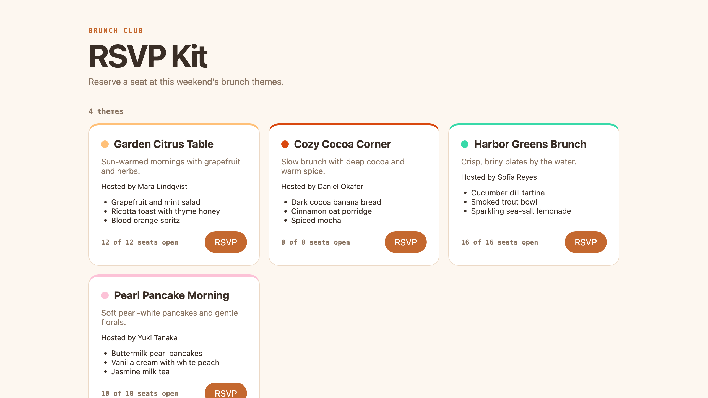

# Map and Update a Cross-Repository Brunch Kit with Multi-Folder Project Context

**In this codelab you use an Antigravity 2.0 multi-folder Project to work across five repositories at once**, rolling one new brunch theme through all of them while a custom read-only boundary protects a cloned external design system you are not allowed to change.

Brunch RSVP system spanning five repos plus one external, read-only dependency
([Open Color](https://github.com/yeun/open-color) design tokens). You define
a multi-folder Antigravity 2.0 Project, lock the external dependency to read-only
with a custom project configuration, map full-stack dependencies with parallel
report-only scout subagents, then let one master agent propagate a single new
theme across exactly the repos that need it — conforming to the read-only tokens
and proving which repos a change does *not* (and *cannot*) touch.

**▶️ Start the codelab:** https://happycode.studio/gde-sprint-26-multifolder-public/

## What you'll build

A consistent, contract-valid update to the brunch kit after adding one theme:
the data, tests, and docs gain **Pearl Pancake Morning** (with an accent color
read from the external Open Color tokens), while the shared schema, the
contract-driven frontend, and the read-only `open-color` dependency are correctly
left unchanged.



## Get the starter files

This repo also hosts the published codelab, so you don't need the whole thing.
Pull down just the `workspace/` folder with a sparse checkout — that folder is
your working directory, no copy step needed:

```bash
git clone --no-checkout --depth 1 https://github.com/evanca/gde-sprint-26-multifolder-public.git
cd gde-sprint-26-multifolder-public
git sparse-checkout init --cone
git sparse-checkout set workspace
git checkout
cd workspace
# the five brunch-* folders are separate repos — initialize each one
for repo in brunch-shared-schema brunch-content-data brunch-frontend brunch-tests brunch-docs; do
  ( cd "$repo" && git init -q && git add . && git commit -q -m "Initial $repo" )
done
# clone the external dependency you consume but don't own (read-only)
git clone --depth 1 https://github.com/yeun/open-color
```

- `workspace/` — the five repositories you own (`brunch-shared-schema`,
  `brunch-content-data`, `brunch-frontend`, `brunch-tests`, `brunch-docs`). You
  also clone `open-color` (the real Open Color design tokens) into the workspace
  as an **external, read-only** dependency. The codelab's agent adds one theme
  across the repos that need it while leaving `open-color` untouched.
- [`reference/`](./reference) — the completed end state, for comparison if your
  result differs.

Follow the [codelab](https://happycode.studio/gde-sprint-26-multifolder-public/)
from here.

---

Google Cloud credits were provided for this project as part of the Agentic Architect Sprint 2026.

#AgenticArchitect #GoogleAntigravity
